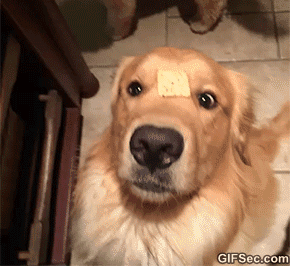

### Howdy 🙃

- 🐍 python = "life"
- 🤖 let javascript = "discord.js";
- 📡 string cpp_and_cs = "still intermediate";
- 🐾 go := "also pretty cool"

Currently learning about game development with Unity and C# and ``<Windows.h>`` for C++.

Send me a message on my discord if you have any issue with my programs: ``kp#3343``

---

---

